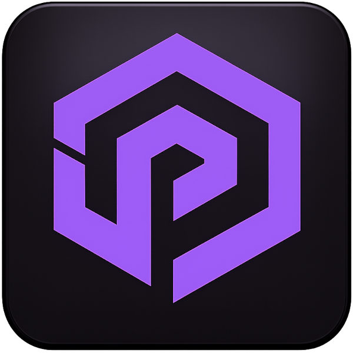
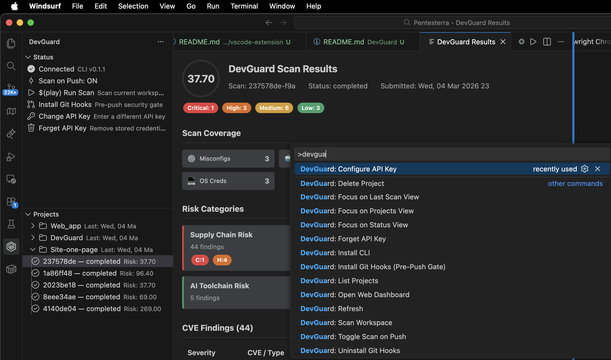
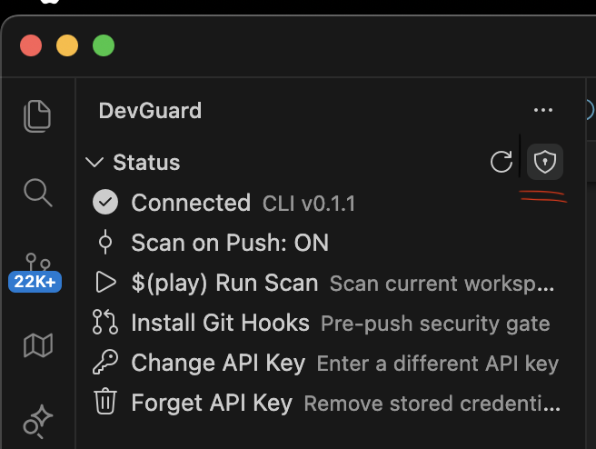
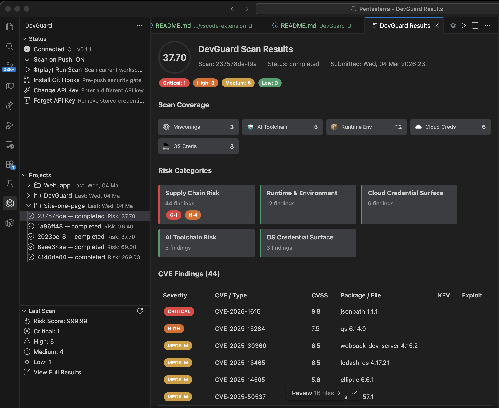
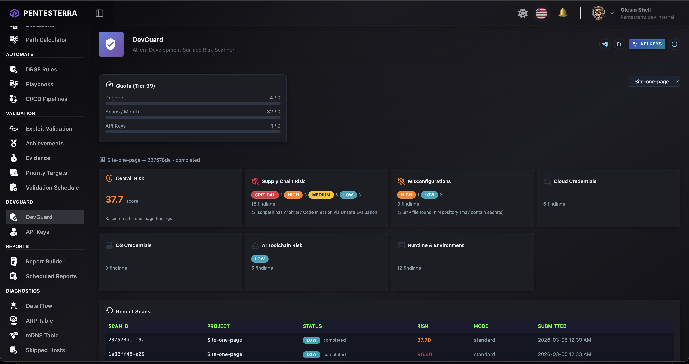
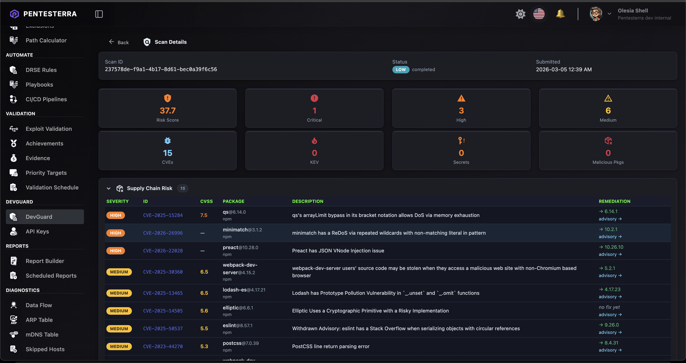

<div align="center">



# Pentesterra DevGuard

**Pre-push security scanner for AI-era developers**

Catch supply chain vulnerabilities, exposed secrets, malicious packages, and AI toolchain threats — before you `git push`.

[](https://www.pentesterra.com/devguard.tar.gz)
[](https://marketplace.visualstudio.com/items?itemName=pentesterra.pentesterra-devguard)
[](https://marketplace.visualstudio.com/items?itemName=pentesterra.pentesterra-devguard)
[](https://www.pentesterra.com/devguard)
[](https://www.pentesterra.com/devguard)
[](https://www.pentesterra.com/devguard)
[](LICENSE)

[**Get Started**](https://www.pentesterra.com/devguard) · [**Documentation**](https://www.pentesterra.com/devguard-guide) · [**Pricing**](https://www.pentesterra.com/pricing) · [**Dashboard**](https://app.pentesterra.com)

</div>

---

## Watch DevGuard in Action

<div align="center">

**Introduction**

[](https://www.youtube.com/watch?v=ueO09RRE0lk)

**How to Use**

[](https://www.youtube.com/watch?v=D3eyUUL4rao)

</div>

---

## What is DevGuard?

DevGuard is a **thin local agent** that scans your project before every push and sends metadata — never your source code — to the Pentesterra cloud for analysis.

```
Your Machine                    Pentesterra Cloud
─────────────────               ────────────────────────────
DevGuard CLI                →   Risk Engine + CVE/KEV KB
  • lockfile parsing              • Supply chain analysis
  • secret pattern matching       • Malicious package detection
  • config file scanning          • SAST scoring
  • MCP / AI toolchain scan  →   • AI threat intelligence
  • endpoint map extraction       • Business logic risk model
─────────────────               ────────────────────────────
No source code uploaded.        Results → Web Dashboard / IDE
```

**Philosophy:** Privacy-first. Your code stays local. DevGuard collects only structural metadata (dependency lists, file paths, secret fingerprints, config flags). Full source is never sent.

---

## Quick Start

### Install CLI

```bash
pip install pentesterra-devguard
```

Or download the archive:

```bash
curl -LO https://www.pentesterra.com/devguard.tar.gz
pip install devguard.tar.gz
```

### Setup & Scan

```bash
# Link to your Pentesterra account
pentesterra-devguard init

# Scan your project
cd /path/to/your/project
pentesterra-devguard scan
```

Results appear in the [Pentesterra Dashboard](https://app.pentesterra.com) and as IDE notifications.

---

## IDE Extension

Install the VS Code extension for automatic scan-on-push, inline risk badges, and a full results panel — without leaving your editor.

**Works with:** VS Code · Cursor · Windsurf

### Install from VS Code Marketplace

Search **"Pentesterra DevGuard"** in the Extensions sidebar, or:

```bash
code --install-extension pentesterra.pentesterra-devguard
```

[**View on VS Code Marketplace →**](https://marketplace.visualstudio.com/items?itemName=pentesterra.pentesterra-devguard)

### Install .vsix manually

**[Download .vsix →](https://www.pentesterra.com/devguard.vsix)**

```bash
code     --install-extension pentesterra-devguard-1.3.17.vsix
cursor   --install-extension pentesterra-devguard-1.3.17.vsix
windsurf --install-extension pentesterra-devguard-1.3.17.vsix
```

---

## Screenshots

<div align="center">


<br/><em>Step 1 — Enter your API key directly in the IDE sidebar</em>

<br/><br/>


<br/><em>Step 2 — Run a scan from the IDE or terminal</em>

<br/><br/>


<br/><em>Step 3 — See findings in the IDE: Supply Chain, Secrets, AI Toolchain, SAST</em>

<br/><br/>


<br/><em>Full results in the Pentesterra Dashboard — risk score, severity breakdown, remediation</em>

<br/><br/>


<br/><em>Detailed scan view — dependency chains, CVE descriptions, fix guidance</em>

</div>

---

## Why DevGuard?

| | DevGuard | GitHub Advanced Security | Snyk | IDE plugins |
|--|:--:|:--:|:--:|:--:|
| Pre-push local project analysis | ✅ | ❌ | ❌ | partial |
| Dependency vulnerability detection | ✅ | ✅ | ✅ | partial |
| **Malicious package detection** | ✅ | ❌ | partial | ❌ |
| Secrets detection before commit | ✅ | partial | partial | partial |
| **Source code sent to cloud** | ❌ never | partial | partial | partial |
| **IDE extension security audit** | ✅ | ❌ | ❌ | ❌ |
| **AI / MCP toolchain analysis** | ✅ | ❌ | ❌ | ❌ |
| **LLM integration & prompt injection** | ✅ | ❌ | ❌ | ❌ |
| **Business logic vulnerability detection** | ✅ | ❌ | ❌ | ❌ |
| SAST without source code upload | ✅ | ❌ | ❌ | partial |
| Auto re-analysis when new CVEs drop | ✅ | partial | partial | ❌ |
| Independent of Git hosting platform | ✅ | ❌ | partial | ✅ |
| Python `.pth` execution hook detection | ✅ | ❌ | ❌ | ❌ |

---

## Key Differentiators

**Privacy-First** — No source code upload. Only metadata and redacted findings leave the developer machine. Use `--dry-run` to inspect the payload before submitting.

**IDE-Native** — VS Code, Cursor, and Windsurf extensions. Auto-installs CLI on first use, auto-updates, sidebar integration, scan-on-push hooks, and inline results.

**Re-Analysis** — When new CVEs are published, previously scanned projects are automatically re-evaluated — no rescan needed.

**Pre-Push Gate** — Git hook blocks push on critical findings. Configurable thresholds. CI/CD mode with exit codes.

---

## What DevGuard Scans (33 Modules)

### Supply Chain & Dependencies
| Module | What it finds |
|--------|--------------|
| **Dependency CVE/KEV mapping** | 15 lockfile parsers: npm, PyPI, Go, Rust, Ruby, PHP, Java, .NET, Swift, Dart — every dep mapped against CVE, KEV, CVSS, and exploit availability |
| **Malicious package detection** | 50+ confirmed malicious packages: event-stream, node-ipc, colors, crewai incidents, typosquats, dependency confusion |
| **Typosquatting detection** | Package names ±1 char from popular libraries |
| **Transitive dependency chain** | DIRECT / TRANSITIVE / DEV — risk-weighted scoring with breadcrumb chains |
| **Python execution hook detection** *(NEW)* | `.pth` files with executable code in `site-packages` (auto-run at every Python startup), credential-harvesting `__init__.py`, `sitecustomize.py` implants — the exact litellm 1.82.8 supply chain attack vector |

### Secrets & Credentials
| Module | What it finds |
|--------|--------------|
| **Secrets exposure** | AWS keys, GCP credentials, GitHub tokens, Stripe, JWT secrets, private keys, `.env` values |
| **Cloud credential surface** | `.aws/`, `.gcloud/`, `.azure/`, kubeconfig, terraform state |
| **OS credential surface** | SSH keys, `.netrc`, `.npmrc` tokens, Docker registry auth, macOS Keychain references |

> Secret values are never transmitted — only type, file path, line number, and a SHA-256 fingerprint.

### AI Toolchain & MCP *(Unique to DevGuard)*
| Module | What it finds |
|--------|--------------|
| **MCP server threat intelligence** | Malicious MCP servers in `.cursor/`, `.windsurf/`, `.vscode/mcp.json`; typosquatted tool names; exfiltration-capable configs |
| **LLM integration risk** | Hardcoded API keys in LiteLLM / OpenRouter / Portkey / Helicone configs; insecure agentic loops; LLM output piped to `exec()` / `subprocess()` (RCE chain) |
| **Prompt injection risks** | User input in `f"...{user_input}..."` → LLM call; system prompt built from DB/API responses; multi-agent trust boundary violations |
| **AI agent configuration** | `ShellTool`, `BashTool`, `PythonREPLTool` without sandboxing; persistent memory storage risks |
| **Vector DB exposure** | Unauthenticated ChromaDB / Qdrant / Weaviate ports; Pinecone, Weaviate, OpenSearch API keys in source |
| **IDE extension threats** | VS Code / Cursor / Windsurf / JetBrains / Zed extensions cross-referenced against malicious blocklist and typosquat patterns |

### Application Security
| Module | What it finds |
|--------|--------------|
| **SAST Lite** *(NEW)* | SQL injection, XSS, command injection, SSRF, insecure deserialization, prototype pollution, prompt injection in Python and JavaScript/TypeScript — no source code sent, only `{type, file, line, snippet_hash}` |
| **Endpoint & auth map** | HTTP routes without auth from FastAPI, Flask, Django, Express, NestJS, Next.js, Rails, Gin, Spring |
| **Business logic risk** *(NEW)* | 7 logic vulnerability classes: Missing Authorization, IDOR, Bypassable Workflow, Unverified State Transitions, Privileged Op Exposed, Race Conditions, Mass Assignment. Composite risk score 0–10 |
| **Business process detection** *(NEW)* | Auto-identifies business processes from metadata — BP-PAY, BP-AUTH, BP-PII with regulatory mapping (PCI-DSS, GDPR, HIPAA, SOX) |
| **Data asset classification** | Field-level ORM inventory (SQLAlchemy, Django, Prisma, TypeORM, Sequelize, Mongoose, GORM, ActiveRecord) — classifies financial, identity, PII, health data |

### Infrastructure & Platform
| Module | What it finds |
|--------|--------------|
| **Dev environment exposure** | `DEBUG=True`, `0.0.0.0` binds, Swagger / actuator endpoints in prod configs |
| **CMS security** | WordPress plugin inventory + known-risky plugins, Drupal modules, Joomla, Magento 2, PrestaShop — debug mode, xmlrpc, admin exposure |
| **Automation platform risk** *(NEW)* | n8n dangerous nodes (Execute Command, Code Node), missing webhook auth, CVE-mapped versions; Zapier / Make / IFTTT webhook secret exposure |
| **Go security** *(NEW)* | `InsecureSkipVerify`, pprof without auth, `math/rand` for crypto, SQL via `fmt.Sprintf`; full route enumeration for Gin, Echo, Chi, Fiber |
| **PHP / Laravel security** *(NEW)* | `eval()`, `exec()`, `shell_exec()`, `unserialize()` on user input; `display_errors`, `allow_url_include`; Laravel `.env` debug exposure |
| **Crypto & TLS weaknesses** | TLS 1.0/1.1, RC4/DES/NULL ciphers, MD5/SHA-1, weak RSA keys (≤1024 bit), deprecated crypto libs — LLM-powered contextual analysis reduces false positives |
| **Runtime & EOL detection** | Node.js, Python, Go EOL schedule; insecure Docker base images |
| **Dev container security** | Privileged containers, host network mode, sensitive volume mounts |
| **Global tools & git hooks** | Malicious `curl`/`wget` in git hooks; outdated global npm/pip packages |
| **Peer dependency conflicts** | Major-version mismatches causing runtime crashes; React 19 incompatibilities; missing required peers |
| **Deprecated API detection** | React legacy lifecycle methods, `ReactDOM.render`, deprecated Node.js `Buffer` constructors, obsolete built-ins |

---

## Privacy-First Design

| What DevGuard collects | What DevGuard never sends |
|------------------------|--------------------------|
| Dependency names and versions | Your source code |
| File paths and line numbers | Secret values (only SHA-256 fingerprints) |
| Config flag presence (`DEBUG=True`) | Private keys or tokens |
| Structural metadata (route paths, ORM field names) | File contents |

Inspect exactly what will be sent before submitting:

```bash
pentesterra-devguard scan --dry-run
```

---

## Re-analysis Without Rescanning

When a new CVE drops, Pentesterra automatically re-scores your existing scans against the updated knowledge base. You get notified — no need to re-run the CLI.

---

## CI/CD Integration

```yaml
# GitHub Actions
- name: DevGuard Security Scan
  run: |
    pip install pentesterra-devguard
    pentesterra-devguard scan --ci --wait --fail-on critical
  env:
    DEVGUARD_API_KEY: ${{ secrets.DEVGUARD_API_KEY }}
```

```bash
# Fail on critical findings or KEV-listed CVEs
pentesterra-devguard scan --ci --wait --fail-on critical --fail-on kev
```

See [docs/ci-cd.md](docs/ci-cd.md) for GitLab CI, branch protection rules, and environment variable reference.

---

## Supported Ecosystems

| Language / Platform | Lockfile / Source |
|--------------------|-------------------|
| JavaScript / Node.js | `package-lock.json`, `yarn.lock`, `pnpm-lock.yaml` |
| Python | `requirements.txt`, `poetry.lock`, `Pipfile.lock` |
| Go | `go.mod`, `go.sum` |
| PHP | `composer.lock` |
| Ruby | `Gemfile.lock` |
| Rust | `Cargo.lock` |
| Java | `pom.xml`, `build.gradle` |
| .NET | `packages.lock.json` |
| Swift | `Package.resolved` |
| Dart / Flutter | `pubspec.lock` |
| WordPress / Drupal / Joomla / Magento | CMS-specific config files |
| AI / LLM | LiteLLM, LangChain, LlamaIndex, CrewAI, AutoGen, DSPy configs |

---

## CLI Reference

```
pentesterra-devguard <command> [options]

Commands:
  init              Configure API key and project
  scan [path]       Run security scan (default: current directory)
  status <scan_id>  Check scan status
  results <id>      View detailed findings
  projects          List your projects
  scans             List recent scans
  quota             Check usage quota
  update            Update CLI to latest version

Options:
  --json            Machine-readable JSON output (used by IDE extension)
  --dry-run         Show what would be collected, without sending
  --ci              Non-interactive mode for CI/CD
  --wait            Poll until results are ready
  --fail-on         Exit non-zero on findings: critical / high / kev
  --scan-mode       standard (default) or deep
```

---

## Download

| Component | Link |
|-----------|------|
| **CLI** (pip archive) | [devguard.tar.gz](https://www.pentesterra.com/devguard.tar.gz) |
| **IDE Extension** (.vsix) | [devguard.vsix](https://www.pentesterra.com/devguard.vsix) |
| **VS Code Marketplace** | [pentesterra.pentesterra-devguard](https://marketplace.visualstudio.com/items?itemName=pentesterra.pentesterra-devguard) |

Or install via pip:

```bash
pip install pentesterra-devguard
```

---

## Pricing

| Tier | Projects | Scans/month | Modes |
|------|----------|-------------|-------|
| **Free** | 1 | 20 | Standard |
| **Starter** | 5 | 100 | Standard + Deep |
| **Pro** | Unlimited | Unlimited | All + CI/CD |
| **Enterprise** | Custom | Custom | Custom SLA |

[See full pricing →](https://www.pentesterra.com/pricing)

---

## The Bigger Picture

DevGuard is the **shift-left entry point** to the Pentesterra platform:

```
DevGuard (pre-push)  →  Web App Pentest  →  Network Pentest  →  Continuous Monitoring
```

Start free with DevGuard. When you need a full pentest, your project history, business logic model, and attack surface map are already in Pentesterra — ready to use.

---

## Get Started

1. [Sign up at pentesterra.com](https://www.pentesterra.com/devguard) — free tier, no credit card
2. Get your API key from the dashboard
3. `pip install pentesterra-devguard && pentesterra-devguard init`

---

## Links

- [Website](https://www.pentesterra.com)
- [DevGuard product page](https://www.pentesterra.com/devguard)
- [DevGuard Guide](https://www.pentesterra.com/devguard-guide)
- [Changelog](https://www.pentesterra.com/changelog)
- [Dashboard](https://app.pentesterra.com)
- [VS Code Marketplace](https://marketplace.visualstudio.com/items?itemName=pentesterra.pentesterra-devguard)
- [Report an issue](https://github.com/pentesterra/DevGuard/issues)

---

<div align="center">

**Pentesterra DevGuard** — Write fast. Ship fast. Ship secure.

[pentesterra.com](https://www.pentesterra.com)

</div>
